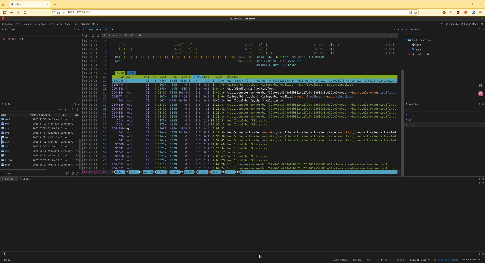

# Selkies-WindTerm


基于 Docker 的WindTerm Linux 客户端，使用 Selkies WebRTC 技术提供浏览器访问支持。


## 使用方式
#### 镜像构建

```
git clone https://github.com/FunkyPantsSa/Selkies-WindTerm.git
cd Selkies-WindTerm
docker build -t windterm  . -f Dockerfile_windterm
````


####  运行
```
mkdir data && chmod 777 data

docker run --rm -it -v ./data:/data -p 3001:3001 \
     -e  CUSTOM_USER=<your user> \
     -e  PASSWORD=<your PASSWORD> \
     windterm bash

```

#####  数据卷挂载

- `./data:/data`: WindTerm数据持久化目录


#### 浏览器访问
```
https://ip:3001
```

### 配置说明

更多自定义配置请参考 [Selkies Base Images from LinuxServer](https://github.com/linuxserver/docker-baseimage-selkies)。


### 运行截图：

